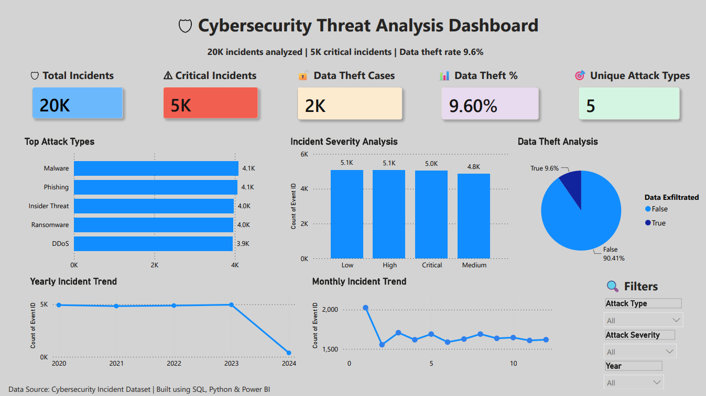

# 🛡️ Cybersecurity Threat Analysis Dashboard

An interactive Cybersecurity Threat Analysis Dashboard built using **SQL, Python, DAX, and Power BI** to analyze cybersecurity incidents, attack severity, attack types, data theft trends, and yearly/monthly incident patterns.

---
## 📊 Dashboard Preview

---
## 📖 Project Overview

This project analyzes cybersecurity incidents using SQL, Python, DAX, and Power BI to identify attack trends, critical incidents, data theft patterns, and severity levels. The dashboard enables users to explore the data interactively through dynamic filters and KPI cards, making it easier to monitor cybersecurity risks and support data-driven decision-making.

---
